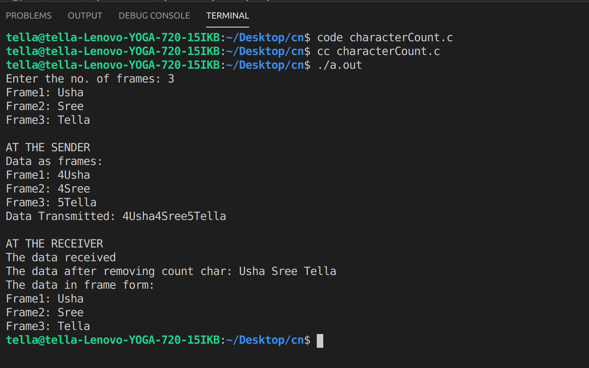

# Experiment 1
## AIM 

To implement data link layer framing technologies such as  
1.character count  
2.characyer stuffing  
3.bit stuffing  

## Procedure  
### 1. Procedure for Character Count

## **Output**
### Character Count Output  

